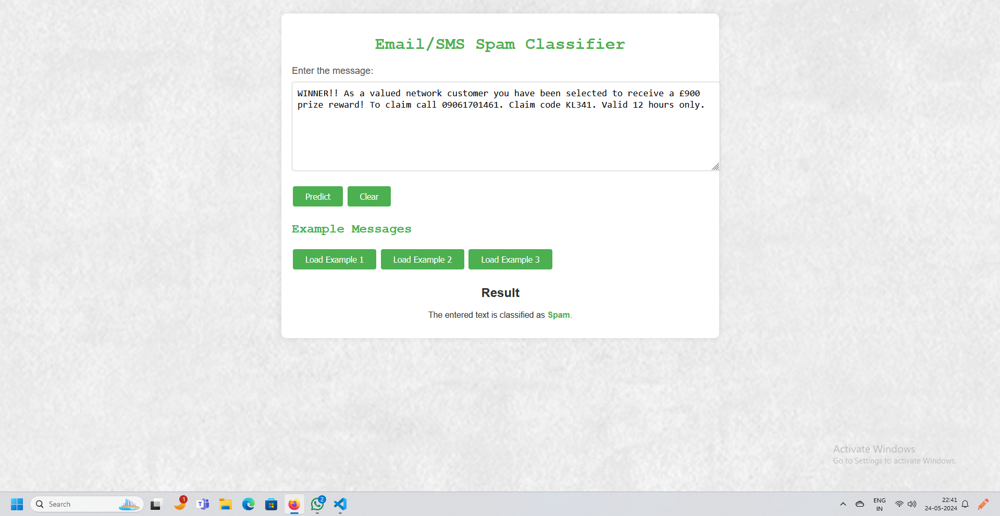

# SMS/Email Spam Classifier

This is a web application for classifying SMS or email messages as Spam or Not Spam using a trained machine learning model. The application is built with Flask and uses a pre-trained TF-IDF vectorizer and a machine learning model for predictions.

## Table of Contents
- [Features](#features)
- [Installation](#installation)
- [Usage](#usage)
- [Project Structure](#project-structure)
- [Example Messages](#example-messages)
- [Screenshots](#screenshots)
- [License](#license)

## Features
- Classify SMS or email messages as Spam or Not Spam.
- Load example messages for quick testing.
- Clear the input message to start fresh.

## Installation

1. Clone the repository:
    ```sh
    git clone https://github.com/yourusername/spam-classifier.git
    cd spam-classifier
    ```

2. Create and activate a virtual environment:
    ```sh
    python -m venv venv
    source venv/bin/activate  # On Windows, use `venv\Scripts\activate`
    ```

3. Install the required packages:
    ```sh
    pip install -r requirements.txt
    ```

4. Ensure NLTK data is downloaded:
    ```sh
    python -m nltk.downloader punkt stopwords
    ```

5. Place the `vectorizer.pkl` and `model.pkl` files in the project directory.

## Usage

1. Run the Flask app:
    ```sh
    python app.py
    ```

2. Open your web browser and navigate to `http://127.0.0.1:5000`.

3. Enter an SMS or email message in the input box and click "Predict" to classify the message as Spam or Not Spam.

4. Use the "Load Example" buttons to test with predefined example messages.

5. Click "Clear" to reset the input box.

## Project Structure

spam-classifier/
│
├── template/
│ └── index.html # HTML template for the web interface
│
├── app.py # Main Flask application
├── vectorizer.pkl # Pre-trained TF-IDF vectorizer
├── model.pkl # Trained classification model
├── requirements.txt # Python packages requirements
├── screenshots/ # Folder containing screenshots
├── README.md # Project README file


## Example Messages

1. **Example 1**: "Free entry in 2 a weekly competition to win FA Cup final tickets. Text FA to 87121 to receive entry question(std txt rate)"
2. **Example 2**: "Nah I don't think he goes to usf, he lives around here though"
3. **Example 3**: "WINNER!! As a valued network customer you have been selected to receive a £900 prize reward! To claim call 09061701461. Claim code KL341. Valid 12 hours only."

## Screenshots

### Home Page


### Prediction Example


### Example Message Loaded


## License

This project is licensed under the MIT License. See the [LICENSE](LICENSE) file for details.
